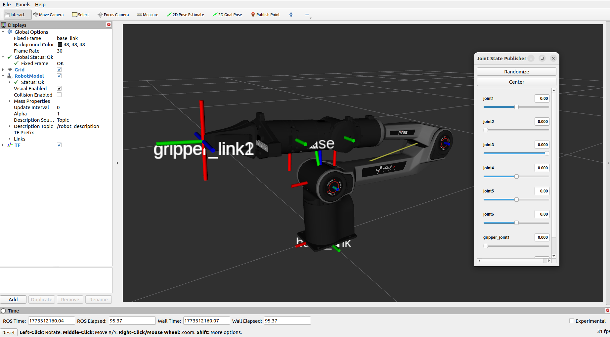
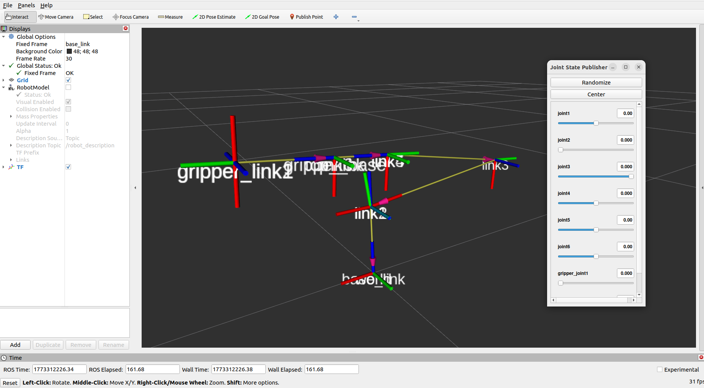
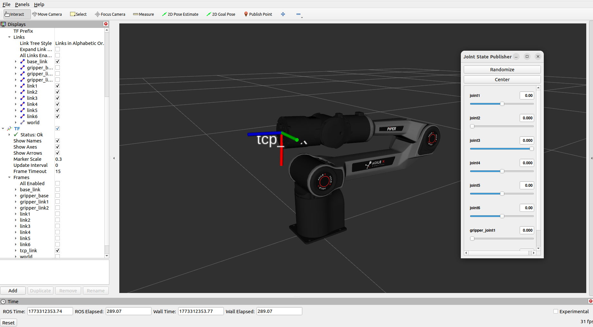
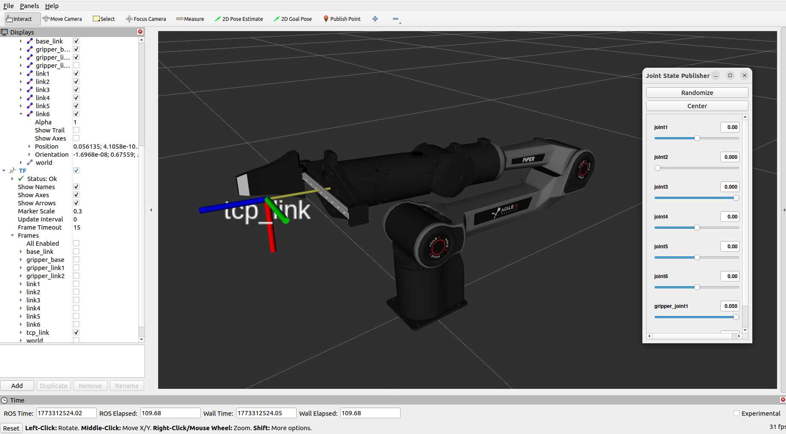

# TCP偏移设置

[English](./TCP_OFFSET_EN.md)

本文档详细说明 `tcp_offset` 参数的定义、单位及通过RViz查看法兰盘中心坐标系的操作步骤，帮助您精准配置工具中心点偏移。

## 一、tcp_offset 参数定义

`tcp_offset` 的6个数值依次对应：`[x, y, z, rx, ry, rz]`，各维度含义与单位如下：
| 维度 | 单位 | 说明 |
|------|------|------|
| x/y/z | 米 (m) | 工具中心相对法兰盘中心的**空间位置偏移** |
| rx/ry/rz | 弧度 (rad) | 工具中心相对法兰盘中心的**姿态偏移** |

## 二、查看法兰盘中心坐标系（RViz可视化）

通过以下步骤可在RViz中直观查看机械臂法兰盘中心的坐标系，为TCP偏移配置提供参考。

### 2.1 启动 RViz 可视化

打开终端窗口，执行以下命令：

```bash
cd ~/agx_arm_ws
source install/setup.bash

# Piper 机械臂
ros2 launch agx_arm_description display.launch.py arm_type:=piper

# Nero 机械臂
ros2 launch agx_arm_description display.launch.py arm_type:=nero

# 其他臂型（piper_x、piper_l、piper_h）
ros2 launch agx_arm_description display.launch.py arm_type:=piper_x
```

带末端执行器：

```bash
# Piper + 夹爪
ros2 launch agx_arm_description display.launch.py arm_type:=piper effector_type:=agx_gripper

# Nero + 灵巧手
ros2 launch agx_arm_description display.launch.py arm_type:=nero effector_type:=revo2 revo2_type:=left
```

### 2.2 查看坐标系

在 RViz 界面中，TF 显示默认开启，可以直接看到所有坐标系（包括法兰盘 `link6`/`link7`）。

也可以通过展开左侧面板的 `RobotModel` → `Links`，勾选需要查看的 link 以显示其坐标轴：

**Piper 机械臂示例：**





## 三、在 RViz 中预览 TCP 偏移

`display.launch.py` 支持 `tcp_offset` 参数，设置后 RViz 中会自动显示 `tcp_link` 坐标系：

```bash
# 在 link6 前方 0.12m 处显示 tcp_link
ros2 launch agx_arm_description display.launch.py arm_type:=piper effector_type:=agx_gripper tcp_offset:='[0.0, 0.0, 0.12, 0.0, 0.0, 0.0]'
```

参数格式为 `[x, y, z, rx, ry, rz]`，所有值均为浮点数，单位与[第一节](#一tcp_offset-参数定义)一致。

> **提示：** MoveIt 同样支持 `tcp_offset` 参数，设置后规划目标和交互标记会对齐到 TCP 位置：
>
> ```bash
> ros2 launch agx_arm_moveit demo.launch.py arm_type:=piper effector_type:=agx_gripper tcp_offset:='[0.0, 0.0, 0.12, 0.0, 0.0, 0.0]'
> ```

