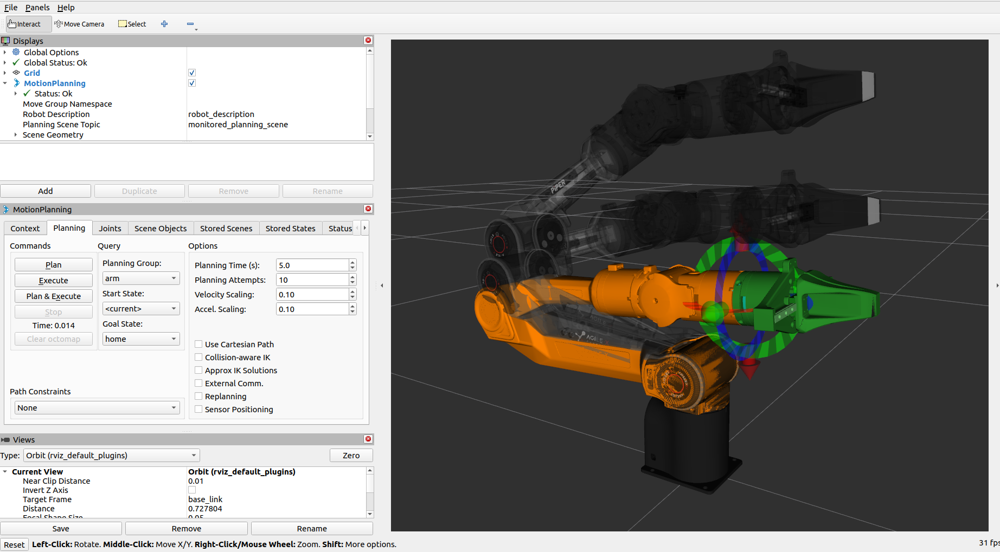

# agx_arm_moveit

[English](./README_EN.md)

|ROS |STATE|
|---|---|
|||
|||

> 注：安装使用过程中出现问题可查看[第4部分](#4-可能遇见的问题)

## 概述

`agx_arm_moveit` 是 AgileX 系列机械臂的统一 MoveIt2 配置包，通过参数化设计支持所有臂型和末端执行器的组合，无需为每种配置维护独立的功能包。

**支持的臂型：** `nero`、`piper`、`piper_h`、`piper_l`、`piper_x`、

**支持的末端执行器：** 无末端执行器 (`none`)、AgileX 夹爪 (`agx_gripper`)、Revo2 灵巧手 (`revo2`)

**规划组与预设动作：**

| 规划组 | 说明 | 预设状态 |
|--------|------|----------|
| `arm` | 机械臂主体 | `home` — 零位姿态 |
| `gripper` | AgileX 夹爪（需 `effector_type:=agx_gripper`） | `gripper_open` — 完全张开<br>`gripper_half` — 半开<br>`gripper_close` — 完全闭合 |
| `hand` | Revo2 灵巧手（需 `effector_type:=revo2`） | `hand_open` — 张开<br>`hand_half_close` — 半握<br>`hand_close` — 握拳 |

---

## 1 安装 MoveIt2

1）二进制安装，[参考链接](https://moveit.ai/install-moveit2/binary/)

```bash
sudo apt install ros-$ROS_DISTRO-moveit*
```

2）源码编译方法，[参考链接](https://moveit.ai/install-moveit2/source/)

---

## 2 安装依赖

安装完 MoveIt2 之后，需要安装一些依赖

```bash
sudo apt-get install -y \
    ros-$ROS_DISTRO-control* \
    ros-$ROS_DISTRO-joint-trajectory-controller \
    ros-$ROS_DISTRO-joint-state-* \
    ros-$ROS_DISTRO-gripper-controllers \
    ros-$ROS_DISTRO-trajectory-msgs
```

若系统语言区域设置不为英文区域，须设置

```bash
echo "export LC_NUMERIC=en_US.UTF-8" >> ~/.bashrc
source ~/.bashrc
```

---

## 3 使用方法

### 3.1 仿真演示（无需真实机械臂）

打开终端，运行以下指令：

```bash
cd ~/agx_arm_ws
source install/setup.bash
```

#### 3.1.1 无末端执行器

```bash
# Piper 机械臂
ros2 launch agx_arm_moveit demo.launch.py arm_type:=piper

# Nero 机械臂
ros2 launch agx_arm_moveit demo.launch.py arm_type:=nero

# 其他臂型：piper_x、piper_l、piper_h
ros2 launch agx_arm_moveit demo.launch.py arm_type:=piper_x
```

#### 3.1.2 带夹爪

```bash
# Piper + 夹爪
ros2 launch agx_arm_moveit demo.launch.py arm_type:=piper effector_type:=agx_gripper

# Nero + 夹爪
ros2 launch agx_arm_moveit demo.launch.py arm_type:=nero effector_type:=agx_gripper
```

#### 3.1.3 带灵巧手

```bash
# Piper + 左手灵巧手
ros2 launch agx_arm_moveit demo.launch.py arm_type:=piper effector_type:=revo2 revo2_type:=left

# Nero + 右手灵巧手
ros2 launch agx_arm_moveit demo.launch.py arm_type:=nero effector_type:=revo2 revo2_type:=right
```

### 3.2 控制真实机械臂

#### 方式一：一键启动（推荐）

一条命令同时启动机械臂控制节点和 MoveIt2，自动接入关节反馈：

```bash
cd ~/agx_arm_ws
source install/setup.bash

# Piper + 夹爪
ros2 launch agx_arm_ctrl start_single_agx_arm_moveit.launch.py can_port:=can0 arm_type:=piper effector_type:=agx_gripper

# Nero + 灵巧手
ros2 launch agx_arm_ctrl start_single_agx_arm_moveit.launch.py can_port:=can0 arm_type:=nero effector_type:=revo2 revo2_type:=left

# Piper_X + 命名空间（多实例场景）
ros2 launch agx_arm_ctrl start_single_agx_arm_moveit.launch.py can_port:=can0 arm_type:=piper_x namespace:=piper_x
```

> 该 launch 支持所有 `agx_arm_ctrl` 参数（如 `tcp_offset`、`speed_percent`、`auto_enable` 等），详见 [agx_arm_ctrl 启动参数](../../README.md#启动参数)。
> - `follow` 默认为 `true`，MoveIt 会订阅 `feedback_topic`（默认 `feedback/joint_states`）跟随真实臂状态
> - `auto_control_gate` 默认为 `false`：默认不启用自动门控；此时会自动将 `control_enabled` 设为 `true`（允许控制）。
> - 当 `auto_control_gate:=true` 时：会启动 `agx_arm_control_gate`，并将 `control_enabled` 自动设为 `false`，仅在轨迹执行阶段通过 `control_gate_service` 指定的 `SetBool` 服务自动开门（默认 `control_enable`，与 `agx_arm_ctrl` 提供的门控服务名一致；多臂时可自定义）。
> - 需要多机械臂并行时，可为该 launch 指定 `namespace`（例如 `namespace:=piper_x`）

#### 3.2.1 MoveIt 门控机制说明（`auto_control_gate`）

为避免 MoveIt 空闲阶段持续发布控制相关话题对真机造成占用，`start_single_agx_arm_moveit.launch.py` 提供了执行期门控能力：

- **门控服务**：`std_srvs/SetBool`，由 `agx_arm_ctrl` 提供；`demo.launch.py` 中通过 **`control_gate_service`** 指定门控节点要调用的服务名（默认 `control_enable`，映射到 `agx_arm_control_gate` 的 `gate_service_name`）。相对名会落在当前 launch 的命名空间下；也可用 **`/...` 绝对服务名** 显式指向某一臂实例。
- **驱动参数**：`control_enabled`
- **MoveIt 门控节点**：`agx_arm_control_gate`（位于 `agx_arm_moveit/scripts`）

工作机制：

1. 当 `auto_control_gate:=false`（默认）时，不启动自动门控节点，且 `control_enabled` 自动设为 `true`，控制链路常开。
2. 当 `auto_control_gate:=true` 时，自动门控节点监听 `arm_controller/follow_joint_trajectory` 执行状态，仅在执行阶段通过 **`control_gate_service` 对应的服务** 开门，执行结束自动关门。

与 `follow:=true` 搭配时，MoveIt 会订阅 `/feedback/joint_states`，以实机真实关节状态作为规划参考，从而在实机当前姿态附近进行规划与执行；但执行前仍受状态更新时间与起点一致性校验影响。

推荐应用场景：

- **场景 A（默认，快速联调）**：连续调试、频繁执行，优先易用性  
  使用 `auto_control_gate:=false`
- **场景 B（实机安全优先）**：希望只在真实执行时放行控制，降低空闲占用风险  
  使用 `auto_control_gate:=true`

启动示例：

```bash
# 场景 A：默认（自动门控关闭，控制常开）
ros2 launch agx_arm_ctrl start_single_agx_arm_moveit.launch.py \
  can_port:=can0 arm_type:=piper effector_type:=agx_gripper

# 场景 B：执行期自动门控（推荐实机）
ros2 launch agx_arm_ctrl start_single_agx_arm_moveit.launch.py \
  can_port:=can0 arm_type:=piper effector_type:=agx_gripper auto_control_gate:=true
```

手动门控调试命令：

```bash
# 开门（允许 /control/*）；默认服务名为 /control_enable（根命名空间）
ros2 service call /control_enable std_srvs/srv/SetBool "{data: true}"

# 关门（拒绝 /control/*）
ros2 service call /control_enable std_srvs/srv/SetBool "{data: false}"
```

若使用 `namespace:=left` 等，门控服务通常为 **`/left/control_enable`**；若自定义了 `control_gate_service`，请将上述命令中的服务名替换为实际全名。

#### 方式二：分步启动

**步骤 1：** 启动机械臂控制节点，详见：[agx_arm_ctrl](../../README.md)

**步骤 2：** 额外启动一个终端，运行 MoveIt2：

```bash
cd ~/agx_arm_ws
source install/setup.bash

# 示例：Piper + 夹爪，控制真实机械臂
ros2 launch agx_arm_moveit demo.launch.py arm_type:=piper effector_type:=agx_gripper follow:=true

# 示例：Nero + 灵巧手，控制真实机械臂
ros2 launch agx_arm_moveit demo.launch.py arm_type:=nero effector_type:=revo2 revo2_type:=left follow:=true
```

### 3.3 启动参数

| 参数 | 默认值 | 说明 | 可选值 |
|------|--------|------|--------|
| `arm_type` | `piper` | 机械臂型号 | `nero`, `piper`, `piper_h`, `piper_l`, `piper_x` |
| `effector_type` | `none` | 末端执行器类型 | `none`, `agx_gripper`, `revo2` |
| `revo2_type` | `left` | Revo2 灵巧手类型 | `left`, `right` |
| `namespace` | 空字符串 | 当前 MoveIt/控制实例命名空间（多实例推荐设置） | 任意合法 ROS 命名空间 |
| `follow` | `false` | 跟随真实机械臂状态（`true` 时 MoveIt 订阅 `feedback_topic`；`false` 时订阅 `control_topic`） | `true`, `false` |
| `feedback_topic` | `feedback/joint_states` | 反馈关节状态话题（`follow:=true` 时使用） | 任意合法 ROS topic |
| `control_topic` | `control/joint_states` | 控制关节状态话题（`follow:=false` 时使用，并用于 ros2_control joint_states remap） | 任意合法 ROS topic |
| `tcp_offset` | `[0.0, 0.0, 0.0, 0.0, 0.0, 0.0]` | TCP 偏移 [x, y, z, rx, ry, rz]（米/弧度），非零时规划目标和交互标记移至 TCP 位置 | - |
| `auto_control_gate` | `false` | 是否启用 MoveIt 执行期自动门控（通过 `control_gate_service` 对应的服务开关 `/control/*`） | `true`, `false` |
| `control_gate_service` | `control_enable` | 仅当 `auto_control_gate:=true` 有效：传给 `agx_arm_control_gate` 的 `gate_service_name`，即要调用的 `std_srvs/SetBool` 服务 basename 或绝对名（须与 `agx_arm_ctrl` 上实际门控服务一致） | 任意合法服务名 |
| `use_rviz` | `true` | 是否启动 RViz | `true`, `false` |
| `db` | `false` | 是否启动 MoveIt warehouse 数据库 | `true`, `false` |

#### 3.3.1 典型使用场景（follow 组合）

结合 `follow` 参数，下面给出 MoveIt 侧的常见使用方式：

- **场景 A：纯模型，无真机（仿真演示）**  
  - 需求：只在 RViz+MoveIt 里看模型、规划轨迹，不连真机。  
  - 配置：`follow:=false`（默认），MoveIt 订阅 `control_topic`（默认 `control/joint_states`），完全在仿真侧运行。  
  - 示例：  
    ```bash
    # 仅仿真，不接入真实机械臂
    ros2 launch agx_arm_moveit demo.launch.py arm_type:=piper effector_type:=none
    ```

- **场景 B：真机 + 仅控制不跟随（MoveIt 作为“上位机控制器”，不实时显示真实反馈）**  
  - 需求：MoveIt 规划并通过 `control_topic` 控制真机，但 RViz 中的状态主要由 MoveIt 自己维护，对真机反馈不敏感（一般不推荐长期这样用，仅用于简单测试）。  
  - 配置：`follow:=false`，MoveIt 订阅 `control_topic`（默认 `control/joint_states`），由 `agx_arm_ctrl` 将控制结果执行到真机。  
  - 示例：  
    ```bash
    # 终端1：启动真机控制
    ros2 launch agx_arm_ctrl start_single_agx_arm.launch.py can_port:=can0 arm_type:=piper effector_type:=agx_gripper

    # 终端2：MoveIt 规划并发 control_topic，不订阅 feedback_topic
    ros2 launch agx_arm_moveit demo.launch.py arm_type:=piper effector_type:=agx_gripper follow:=false
    ```

- **场景 C：真机 + 控制 + 跟随（推荐实机方案）**  
  - 需求：MoveIt 规划控制真实机械臂，同时 RViz 中的模型实时跟随 `feedback_topic`。  
  - 配置：`follow:=true`，MoveIt 改为订阅 `feedback_topic`（默认 `feedback/joint_states`），以真实关节反馈为主。  
  - 示例 1（推荐一键启动，已在本 README 顶部介绍）：  
    ```bash
    ros2 launch agx_arm_ctrl start_single_agx_arm_moveit.launch.py can_port:=can0 arm_type:=piper effector_type:=agx_gripper
    ```
  - 示例 2（分步启动）：  
    ```bash
    # 终端1：启动真机控制
    ros2 launch agx_arm_ctrl start_single_agx_arm.launch.py can_port:=can0 arm_type:=piper effector_type:=agx_gripper

    # 终端2：MoveIt 订阅 feedback_topic，控制 + 跟随
    ros2 launch agx_arm_moveit demo.launch.py arm_type:=piper effector_type:=agx_gripper follow:=true
    ```

> 一般推荐在真机场景下使用 **场景 C（follow:=true）**，保证规划结果与真实机械臂保持一致；场景 B 仅适合对反馈要求不高的简单测试。

### 3.4 RViz 中的操作



- 拖动机械臂末端的交互标记（6D 球）来设定目标位姿
- 在左侧 **MotionPlanning → Planning** 面板中：
  - **Planning Group** 下拉菜单可切换规划组（`arm` / `gripper` / `hand`）
  - **Goal State** 下拉菜单可选择预设动作（如 `home`、`gripper_open`、`hand_close` 等）
  - 点击 **Plan & Execute** 开始规划并执行

### 3.5 Topic 与 Action 轨迹控制

MoveIt 通过 `ros2_control` 的 `JointTrajectoryController` 执行轨迹。RViz 中点击 **Plan & Execute** 时，内部会调用 `arm_controller` 的 Action；也可在命令行手动下发轨迹。

| 接口 | 类型 | 消息/动作类型 | 说明 |
|------|------|---------------|------|
| `/arm_controller/follow_joint_trajectory` | Action | `control_msgs/action/FollowJointTrajectory` | 轨迹执行（推荐），支持执行反馈与取消 |
| `/arm_controller/joint_trajectory` | Topic | `trajectory_msgs/msg/JointTrajectory` | 轨迹下发（fire-and-forget），无执行状态反馈 |
| `/control/joint_states` | Topic | `sensor_msgs/msg/JointState` | 轨迹插值后的关节状态输出（`ros2_control_node` 经 `control_topic` remap 发布） |

> - 以上路径为默认命名空间下的名称；若设置了 `namespace`，请在各接口前加上命名空间前缀（如 `/left/arm_controller/...`）。
> - 控制真实机械臂时，需同时启动 `agx_arm_ctrl`；`agx_arm_ctrl` 订阅 `/control/joint_states` 并将插值结果下发到真机。
> - 若启用了 `auto_control_gate:=true`，执行前须确保门控已打开，否则 `/control/joint_states` 不会被真机接收。
> - Nero 臂型有 7 个关节（`joint1`–`joint7`），其余臂型为 6 个关节（`joint1`–`joint6`）。

#### Piper 示例：Action 下发轨迹

```bash
ros2 action send_goal /arm_controller/follow_joint_trajectory control_msgs/action/FollowJointTrajectory "{
  trajectory: {
    joint_names: [
      'joint1',
      'joint2',
      'joint3',
      'joint4',
      'joint5',
      'joint6'
    ],
    points: [
      { # 1
        positions: [0.0, 0.1, -0.1, 0.0, 0.0, 0.0],
        time_from_start: {sec: 1, nanosec: 0}
      },
      {  # 2
        positions: [0.2, 0.8, -0.8, 0.0, -0.4, 0.0],
        time_from_start: {sec: 3, nanosec: 0}
      },
      {  # 3
        positions: [-0.2, 0.4, -0.4, 0.2, -0.2, 1.57],
        time_from_start: {sec: 5, nanosec: 0}
      },
      {  # 4
        positions: [0.0, 0.2, -0.2, 0.0, 0.0, 0.0],
        time_from_start: {sec: 7, nanosec: 0}
      },
      {  # 5
        positions: [0.0, 0.0, 0.0, 0.0, 0.0, 0.0],
        time_from_start: {sec: 9, nanosec: 0}
      }
    ]
  }
}"
```

#### Piper 示例：Topic 下发轨迹

```bash
ros2 topic pub --once /arm_controller/joint_trajectory \
  trajectory_msgs/msg/JointTrajectory \
  '{
    joint_names: [
      "joint1",
      "joint2",
      "joint3",
      "joint4",
      "joint5",
      "joint6"
    ],
    points: [{
      positions: [0.0, 0.4, -0.6, 0.0, 0.0, 0.0],
      time_from_start: {sec: 2}
    }]
  }'
```

#### 查看轨迹插值输出

控制器按轨迹插值后，将关节状态发布到 `/control/joint_states`（可通过 `control_topic` 参数自定义）：

```bash
ros2 topic echo /control/joint_states
```

---

## 4 可能遇见的问题

### 4.1 运行 demo.launch.py 时报错

报错：参数需要一个 double，而提供的是一个 string
解决办法：
终端运行

```bash
echo "export LC_NUMERIC=en_US.UTF-8" >> ~/.bashrc
source ~/.bashrc
```

或在运行 launch 前加上 `LC_NUMERIC=en_US.UTF-8`
例如

```bash
LC_NUMERIC=en_US.UTF-8 ros2 launch agx_arm_moveit demo.launch.py arm_type:=piper
```
